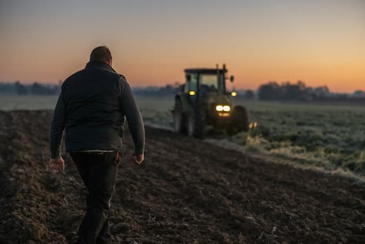

## Predictive Modeling for Agriculture**

In this project, a multi-class classification model was developed to assist farmers in selecting the optimal crop based on essential soil metrics such as nitrogen, phosphorus, potassium levels, and pH value. Using a dataset that captures these soil measurements, the model predicts the most suitable crop for maximizing yield. After evaluating different features, potassium (K) was identified as the most critical predictor for crop selection. The model was implemented using Python, with key libraries including `pandas`, `scikit-learn`, and `metrics` for model training and performance evaluation.
